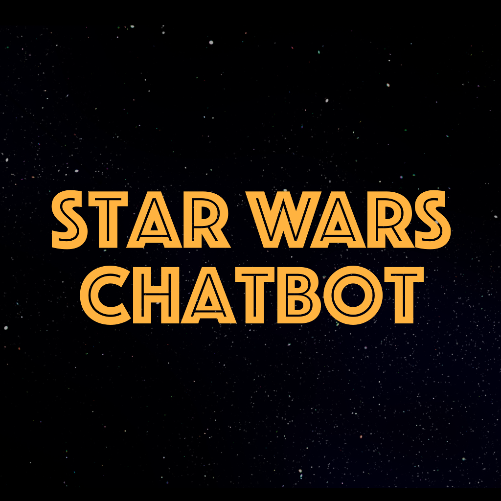
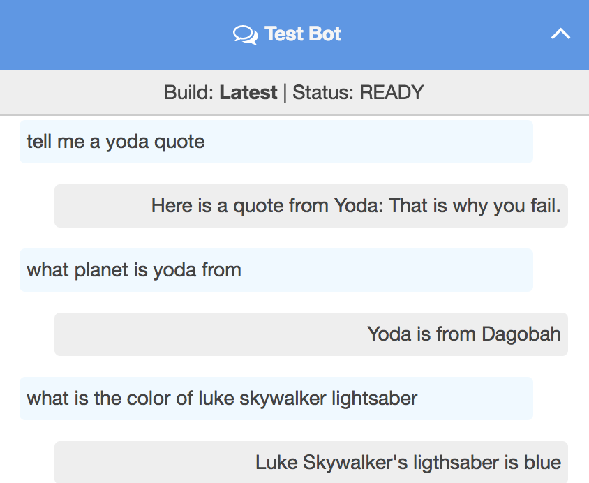
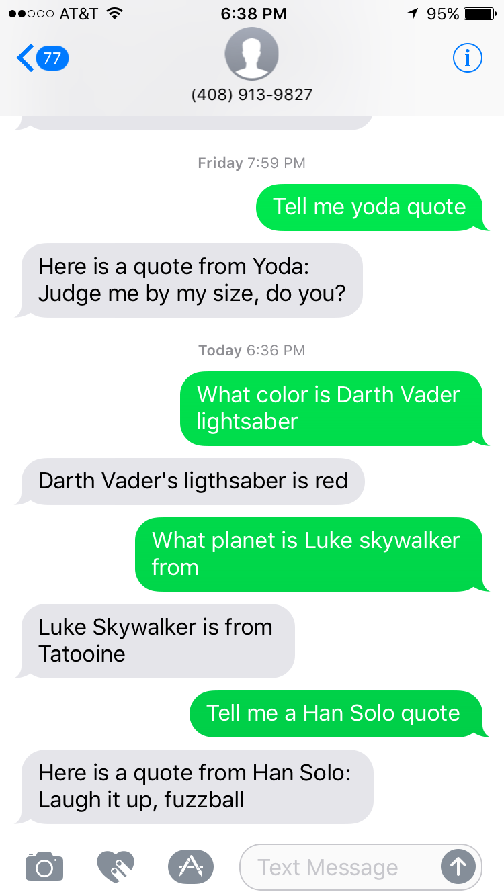

:toc:

= Build Your Own Chatbot using Java

This repository explains how to create a Star Wars chatbot using Amazon Lex and Java.

The users can interact with this chatbot using the following means:

. Voice (Alexa, Phone/Call)
. Text (Phone/SMS, Facebook Messenger, Slack)

Here are the key components of architecture:

image::images/architecture.png[]

== JSON Document

Data is loaded as JSON documents in DynamoDB. Here is a sample JSON document:

[source, json]
----
{
  "dead": true,
  "force-sensitive": true,
  "force-side": "light",
  "id": 1,
  "lightsaber": "green",
  "planet": "Dagobah",
  "quotes": [
    "When nine hundred years old you reach, look as good you will not.",
    "Truly wonderful, the mind of a child is",
    "A Jedi uses the Force for knowledge and defense, never for attack",
    "That is why you fail.",
    "Adventure. Excitement. A Jedi craves not these things.",
    "Judge me by my size, do you?",
    "Fear is the path to the dark side",
    "Wars not make one great",
    "Do, or do not. There is no try",
    "Size matters not",
    "The dark side clouds everything",
    "Impossible to see the future is",
    "Clear your mind must be",
    "Much to learn you still have ... my old padawan"
  ],
  "weapon": "lightsaber",
  "whoami": "Yoda"
}
----

Create Global Secondary Index on `whoami`

== Different platforms

=== Lex

http://docs.aws.amazon.com/lex/latest/dg/using-lambda.html

=== Twilio/SMS

. Send a message to 408-913-9827 as shown below:

Details: https://docs.aws.amazon.com/lex/latest/dg/twilio-bot-association.html

=== Alexa

. Test using http://echosim.io or Alexa

=== Web

TODO

=== Mobile

TODO

== Logging using Amazon CloudWatch

== Monitoring using AWS X-Ray

TODO

== How to talk to the chatbot?

Use phrase `Ask Star Wars` for Alexa, otherwise just the text as is. The list of questions is at https://github.com/demolition16/chatbot.git

